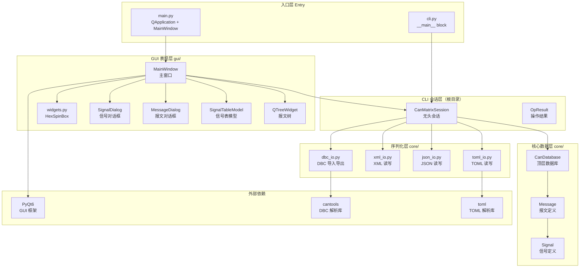
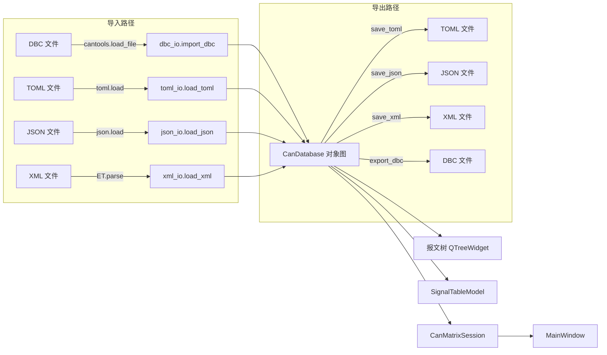
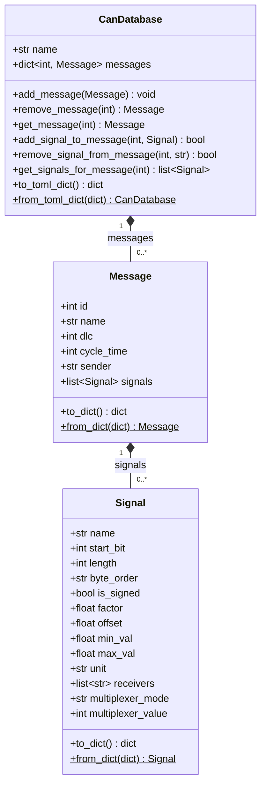
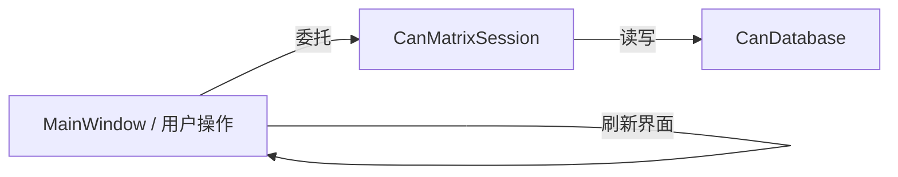
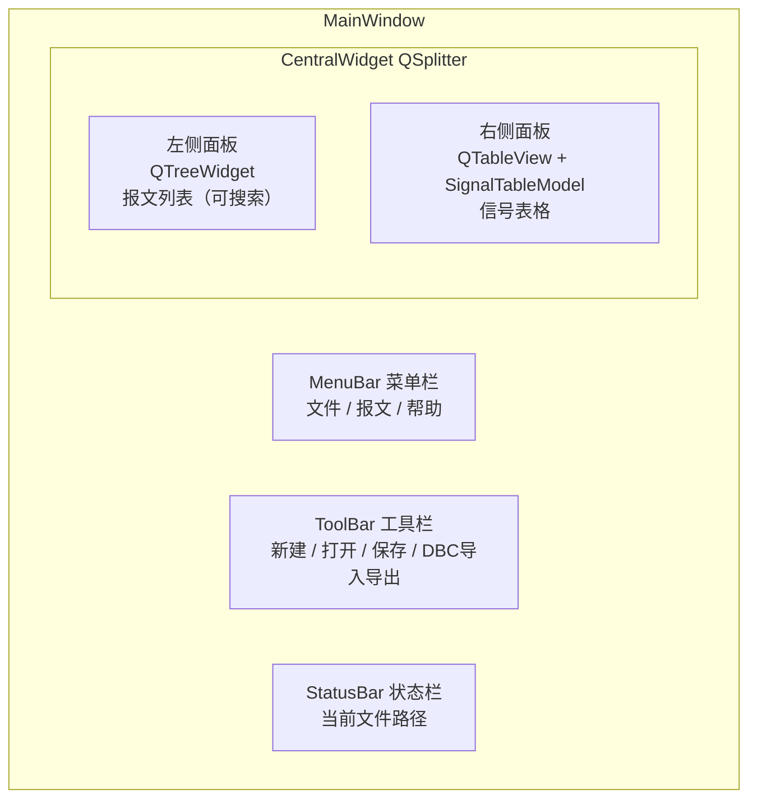
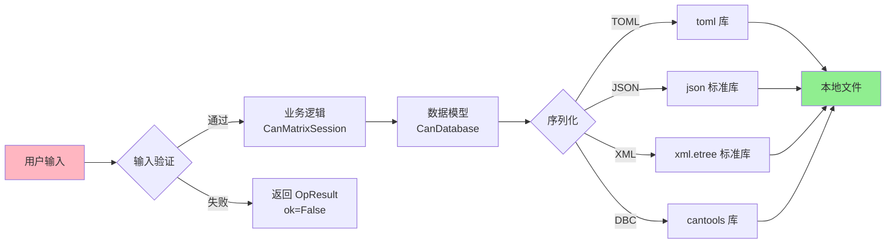
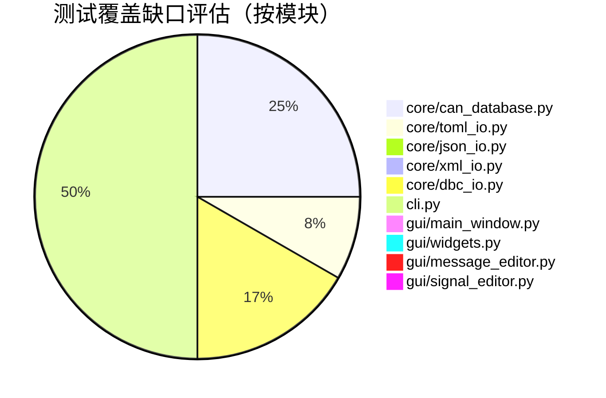
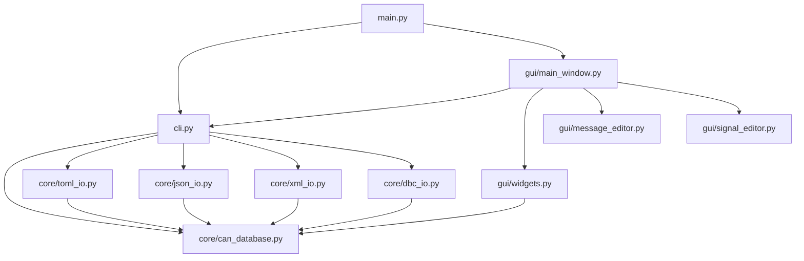

# CanMatrix Editor 软件详细设计文档


> 📅 生成日期：2026-05-28


---


## 第 1 章：概述

### 1.1 项目背景

CAN（Controller Area Network）总线广泛应用于汽车电子和工业控制领域，其矩阵定义（Signal → Message 映射关系）通常以 Vector 公司的 DBC（Database CAN）格式存储。DBC 是 Vector 公司的私有格式，本质是类 INI 的自由文本文件，存在以下痛点：

1. **Git 合并冲突严重**：DBC 以行为单位描述信号（`SG_` 行），增删信号会导致整行位移，Git diff 无法精准定位到具体字段变更，合并时极易产生冲突。
2. **可读性差**：DBC 使用十进制 CAN ID、紧凑的位描述语法（`0|16@1+ (1,0) [0|65535] "rpm" ECU2`），人工阅读和审查困难。
3. **工具链锁定**：主流 DBC 编辑工具（Vector CANdb++、CANoe）为商业软件，且 DBC 格式细节未完全公开，形成工具链锁定。

CanMatrix Editor 的核心目标是：**以 TOML 作为主存储格式，保留与 DBC 工具链的互通能力（导入/导出），解决 Git 版本管理中的合并冲突问题**。

### 1.2 软件目标

| 目标 | 说明 |
|------|------|
| 主存储格式为 TOML | TOML 可读性好、diff 友好、Git 兼容性强 |
| 支持 DBC 导入/导出 | 通过 cantools 库实现与现有 DBC 工具链的互通 |
| 提供 GUI 和 CLI 双操作界面 | GUI 用于交互式编辑，CLI 用于批量处理和单元测试 |
| 信号模型贴合 DBC 语义 | 采用 per-message 信号模型，同名信号在不同报文中可独立定义 |

### 1.3 核心特性

- **TOML 主存储**：信号以 `[[messages.signals]]` 数组形式嵌套在报文下，增删信号只影响该报文块，不会导致文件其他部分位移。
- **稀疏输出**：默认值的字段（`factor=1.0`、`offset=0.0` 等）在保存时省略，减少 diff 噪音。
- **十六进制 CAN ID**：TOML 中 `id = 0x100`，与 CAN 工具链和硬件文档保持一致，避免十进制换算负担。
- **单向数据绑定**：GUI 直接操作 `CanDatabase` 对象图，`SignalTableModel` 是 `QAbstractTableModel` 的薄封装，无中间 ViewModel 层。
- **CLI 无头模式**：所有 GUI 操作均有对应的 `CanMatrixSession` 方法，支持单元测试和批量脚本，无需启动 GUI。
- **安全性**：纯本地应用，不发起网络请求；所有解析使用标准库或 cantools 官方解析器。

### 1.4 与现有工具的对比

| 特性 | Vector CANdb++ | cantools（Python 库） | **CanMatrix Editor** |
|------|-----------------|----------------------|---------------------|
| 图形界面 | ✅ | ❌ | ✅ |
| TOML 存储 | ❌ | ❌ | ✅ |
| Git diff 友好 | ❌ | N/A | ✅ |
| DBC 导入 | ✅ | ✅ | ✅ |
| DBC 导出 | ✅ | ✅ | ✅ |
| CLI/脚本化 | ❌ | ✅ | ✅ |
| 开源 | ❌ | ✅ | ✅ |


---


## 第 2 章：系统架构

### 2.1 整体架构图



### 2.2 模块依赖关系

项目按照**自底向上的依赖方向**组织，高层模块依赖低层模块，反向不成立：

```
gui/ (GUI 表现层)
  └── cli.py (CLI 会话层)
        └── core/ (核心数据 + 序列化层)
              ├── can_database.py  ─── 纯数据模型，无外部依赖
              ├── toml_io.py       ─── 依赖 can_database + toml
              ├── json_io.py       ─── 依赖 can_database + json (stdlib)
              ├── xml_io.py        ─── 依赖 can_database + xml.etree (stdlib)
              └── dbc_io.py        ─── 依赖 can_database + cantools
```

**关键约束**：
- `core/` 模块之间无循环依赖，`can_database.py` 是最底层基础模块。
- `cli.py` 集中导入所有 I/O 模块，作为 facade 统一对外暴露。
- `gui/` 模块只依赖 `cli.py` 和 `core/`，不直接依赖序列化层。

### 2.3 数据流

从文件到 GUI 显示的完整数据流：



> **关键设计**：所有数据流转都经过 `CanDatabase` 对象图。导入时从文件格式反序列化为 `CanDatabase`，导出时从 `CanDatabase` 序列化为目标格式。GUI 编辑直接修改 `CanDatabase` 对象图的内存状态，保存时才持久化到磁盘。


---


## 第 3 章：核心数据模型

### 3.1 设计背景：Per-Message 信号模型

DBC 语义中，**信号是 per-message 的定义**——同一个信号名（如 `RPM`）在报文 A 和报文 B 中可以拥有完全不同的起始位、长度、因子和偏移量。`can_database.py` 的模块注释明确写道：

> Signals are per-message definitions. Each message has its own signal list, and signals with the same name in different messages can have completely different attributes.

因此，本项目**没有全局信号注册表**，而是采用 **per-message 信号模型**：每个 `Message` 对象持有自己的 `signals: list[Signal]`，不同报文中的同名信号是彼此独立的 `Signal` 实例。

### 3.2 Signal 数据类

```python
@dataclass
class Signal:
    """A single CAN signal definition (per-message entity)."""

    name: str = ""
    start_bit: int = 0
    length: int = 8
    byte_order: str = "little_endian"   # "little_endian" | "big_endian"
    is_signed: bool = False
    factor: float = 1.0
    offset: float = 0.0
    min_val: float = 0.0
    max_val: float = 0.0
    unit: str = ""
    comment: str = ""
    receivers: list[str] = field(default_factory=list)
    multiplexer_mode: str = "none"   # "none" | "multiplexer" | "multiplexed"
    multiplexer_value: int = 0
```

**字段说明**：

| 字段 | 类型 | 默认值 | 说明 |
|------|------|--------|------|
| `name` | `str` | `""` | 信号名称，在同一报文中应唯一 |
| `start_bit` | `int` | `0` | 起始位（0~63） |
| `length` | `int` | `8` | 信号长度（位） |
| `byte_order` | `str` | `"little_endian"` | 字节序：Intel（小端）/ Motorola（大端） |
| `is_signed` | `bool` | `False` | 是否有符号整数 |
| `factor` | `float` | `1.0` | 物理值 = 原始值 × factor + offset |
| `offset` | `float` | `0.0` | 偏移量 |
| `min_val` / `max_val` | `float` | `0.0` | 物理值有效范围 |
| `unit` | `str` | `""` | 物理单位（如 `rpm`、`°C`） |
| `receivers` | `list[str]` | `[]` | 接收节点列表 |
| `multiplexer_mode` | `str` | `"none"` | 复用模式：`none` / `multiplexer` / `multiplexed` |
| `multiplexer_value` | `int` | `0` | 复用值（仅 `multiplexed` 模式有效） |

**序列化方法**：
- `to_dict() → dict`：将 Signal 转为纯字典，用于 TOML/JSON/XML 序列化。
- `from_dict(data: dict) → Signal`：类方法，从字典重建 Signal 对象。

### 3.3 Message 数据类

```python
@dataclass
class Message:
    """A CAN message with its own signal definitions."""

    id: int = 0
    name: str = ""
    dlc: int = 8
    cycle_time: int = 0        # ms, 0 = event-triggered
    comment: str = ""
    sender: str = ""
    signals: list[Signal] = field(default_factory=list)  # 信号对象列表
```

**字段说明**：

| 字段 | 类型 | 默认值 | 说明 |
|------|------|--------|------|
| `id` | `int` | `0` | CAN ID（支持 11 位/29 位） |
| `name` | `str` | `""` | 报文名称 |
| `dlc` | `int` | `8` | 数据长度（0~8 字节） |
| `cycle_time` | `int` | `0` | 周期时间（ms），0 表示事件触发 |
| `sender` | `str` | `""` | 发送节点名称 |
| `signals` | `list[Signal]` | `[]` | **该报文包含的信号对象列表** |

> **关键设计**：`signals` 是 `Signal` 对象的列表，不是信号名称的引用。这保证了 per-message 语义——每个报文独立持有自己的信号定义。

### 3.4 CanDatabase 顶层类

```python
class CanDatabase:
    """Top-level CAN database. Signals are per-message definitions."""

    def __init__(self, name: str = "Untitled") -> None:
        self.name: str = name
        self.messages: dict[int, Message] = {}  # key: CAN ID
```

**核心方法**：

| 方法 | 说明 |
|------|------|
| `add_message(msg)` | 按 CAN ID 添加/覆盖报文 |
| `remove_message(msg_id) → Message \| None` | 按 ID 删除报文 |
| `get_message(msg_id) → Message \| None` | 按 ID 获取报文 |
| `update_message(msg_id, **kwargs) → bool` | 按关键字更新报文属性 |
| `add_signal_to_message(msg_id, sig) → bool` | 向指定报文追加信号（不去重） |
| `remove_signal_from_message(msg_id, sig_name) → bool` | 按名称从报文删除信号 |
| `get_signals_for_message(msg_id) → list[Signal]` | 获取指定报文的所有信号 |

**序列化方法**：
- `to_toml_dict() / from_toml_dict(data)`：TOML 友好的字典结构
- `to_json_dict() / from_json_dict(data)`：JSON 友好的字典结构（与 TOML 同构）
- `to_xml_dict() / from_xml_dict(data)`：XML 友好的字典结构（与 TOML 同构）

### 3.5 类图



### 3.6 深拷贝与对象共享问题

当复制报文时，**必须深拷贝信号列表**，否则两个报文会共享同一个 `Signal` 对象列表。项目在 `main_window.py` 的 `_on_duplicate_message` 方法中显式处理：

```python
import copy
new_msg = Message(
    id=new_id,
    name=f"{msg.name}_copy",
    dlc=msg.dlc,
    cycle_time=msg.cycle_time,
    comment=msg.comment,
    sender=msg.sender,
    signals=[copy.deepcopy(s) for s in msg.signals],  # 深拷贝每个 Signal
)
```

测试文件 `test_per_message.py` 中也有对应验证：

```python
msg2_ref = sess.database.messages[0x200]
dup_ref = sess.database.messages[0x300]
msg2_ref.signals[0].factor = 2.0
assert dup_ref.signals[0].factor == 1.0, "Deep copy failed: signals are shared!"
```


---


## 第 4 章：序列化格式设计

### 4.1 TOML 为主存储格式的设计理由

项目在 `README.md` 中明确陈述了选择 TOML 的理由：

> TOML is the primary storage format because it is human-readable, diff-friendly, and easily version-controlled with Git.

与候选格式的对比：

| 维度 | TOML | DBC（原始） | JSON | XML |
|------|------|-------------|------|-----|
| **可读性** | ★★★★★ 节/表头清晰 | ★★ 紧凑但晦涩 | ★★★ 引号多 | ★★ 标签噪音大 |
| **Git diff 友好** | ★★★★★ 增删只影响局部 | ★★ `SG_` 行位移 | ★★★ 最后一项逗号 | ★★ 标签嵌套深 |
| **CAN 语义贴合** | ★★★★ 支持 `0x` 十六进制 | ★★★ 十进制 ID | ★★★ 十/十六进制 | ★★★ 十/十六进制 |
| **注释支持** | ★★★★★ `#` 注释 | ★★★ `CM_` 注释行 | ❌ 无原生注释 | ★★★ `<!-- -->` |
| **数组表示** | ★★★★ `[[ ]]` 直观 | N/A | ★★★★★ | ★★ 重复标签 |
| **Python 生态** | ★★★★ `toml` 库成熟 | `cantools` 支持 | stdlib | stdlib |
| **合并冲突处理** | ★★★★★ 语义合并 | ★ 行级冲突 | ★★ 语义合并 | ★★ 语义合并 |

> **核心诉求**：DBC 格式在 Git 管理时，增删一个信号会导致后续所有 `SG_` 行位移，产生大量无意义的合并冲突。TOML 中每个报文是一个独立的 `[[messages]]` 块，增删操作只影响该块，其他报文完全不受影响。

### 4.2 TOML 格式结构

示例文件（`example.toml`）：

```toml
name = "MyVehicle"

[[messages]]
id = 0x100
name = "EngineData"
dlc = 8
cycle_time = 10
sender = "ECU1"

[[messages.signals]]
name = "RPM"
start_bit = 0
length = 16
byte_order = "little_endian"
factor = 1.0
offset = 0.0
min_val = 0.0
max_val = 8000.0
unit = "rpm"
receivers = ["BCM", "ICU"]

[[messages.signals]]
name = "CoolantTemp"
start_bit = 16
length = 8
factor = 1.0
offset = -40.0
max_val = 215.0
unit = "°C"
```

**数据结构映射**：

| TOML 结构 | Python 类型 |
|-----------|-------------|
| `name = "..."` | `CanDatabase.name` |
| `[[messages]]` | 每个表项 → 一个 `Message` 对象 |
| `[[messages.signals]]` | 嵌套数组 → 该 Message 的 `signals: list[Signal]` |

> **关键设计**：`messages` 按 CAN ID 升序排列（`sorted(database.messages.items())`），保证同一数据每次保存时产生相同的文件排列，进一步减少 diff 噪音。

### 4.3 稀疏输出策略

保存时只输出**非默认值**的字段，源文件 `toml_io.py` 注释：

> Only write non-default values to keep the TOML file clean and minimize diffs.

实现逻辑（简化）：

```python
SIGNAL_DEFAULTS = {
    "start_bit": 0, "length": 8, "byte_order": "little_endian",
    "is_signed": False, "factor": 1.0, "offset": 0.0,
    "min_val": 0.0, "max_val": 0.0, "unit": "", "comment": "",
    "receivers": [], "multiplexer_mode": "none", "multiplexer_value": 0,
}

def _sparse_signal_dict(signal: Signal) -> dict:
    raw = signal.to_dict()
    return {k: v for k, v in raw.items() if v != SIGNAL_DEFAULTS.get(k)}
```

**效果对比**：

- 一个完整的 Signal 字典有 14 个键，其中 `factor=1.0`、`offset=0.0`、`byte_order="little_endian"` 等 10 个字段往往为默认值。
- 稀疏输出后平均只输出 4~6 个字段，减少 60% 以上的行数。
- 修改一个信号值时，只在其所在行新增/修改一行，不会引发邻行位移。

### 4.4 十六进制 CAN ID

TOML 输出时 CAN ID 使用 `0x` 前缀的十六进制格式：

```python
# toml_io.py: 保存时转换
output["id"] = f"0x{msg.id:X}"  # → TOML: id = "0x100"
```

读取时解析回整数：

```python
# can_database.py: 反序列化时解析
if isinstance(id_val, str) and id_val.startswith("0x"):
    id_val = int(id_val, 16)
```

> **设计理由**：CAN 总线工程中 ID 传统上以十六进制表示（如 `0x3E8`、`0x7DF`），CAN 工具链和硬件数据手册均以十六进制标注。保持十六进制减少工程师的"手动换算"负担。

### 4.5 DBC 导入/导出

导入（`dbc_io.import_dbc()`）：

1. 调用 `cantools.database.load_file(dbc_path)` 解析 DBC
2. 遍历 `cantools` 返回的 `database.messages`，将每个 `cantools.database.can.Message` 转换成本项目的 `Message` 对象
3. 遍历每个报文中的 `cantools.database.can.Signal`，转换成本项目的 `Signal` 对象
4. 构建并返回 `CanDatabase` 对象

导出（`dbc_io.export_dbc()`）：

1. 构建 `cantools` 所需的 `Database()` 对象
2. 遍历 `CanDatabase.messages`，添加报文和信号
3. 调用 `cantools.database.dump_file(database, dbc_path)` 写入 DBC 文件

### 4.6 JSON/XML 导入/导出

JSON 和 XML 的字典结构与 TOML 完全同构（共用 `to_json_dict()` / `to_xml_dict()`），区别仅在序列化语法上：

- **JSON**：`json.dump(data, fp, indent=2)` / `json.load(fp)`
- **XML**：`xml.etree.ElementTree` 手动递归构建/解析

这保证了三种文本格式之间的数据一致性——同一份 `CanDatabase` 对象输出到 TOML、JSON、XML 时，结构化数据完全相同。


---


## 第 5 章：CLI 层设计

### 5.1 CanMatrixSession 设计

`cli.py` 定义了 `CanMatrixSession` 类，作为**无头（headless）会话**，镜像 GUI 的所有操作。所有业务逻辑集中在 CLI 层，GUI 只负责界面交互并委托给 Session。

```python
class CanMatrixSession:
    """Headless session mirroring GUI operations."""

    def __init__(self, db: CanDatabase | None = None) -> None:
        self.database = db or CanDatabase()
        self.current_file: str | None = None
```

**设计要点**：
- `database` 属性持有当前打开的 `CanDatabase` 对象，所有操作直接修改该对象。
- `current_file` 记录最近一次打开/保存的文件路径，用于"保存"操作的默认路径。
- 无头模式：不依赖 PyQt，可直接在命令行或测试脚本中实例化。

### 5.2 OpResult 模式

所有修改性操作返回 `OpResult` 对象，而非直接抛异常或返回 `None`：

```python
@dataclass
class OpResult:
    ok: bool
    data: T | None = None
    error: str = ""
```

**与异常机制的区别**：

| 机制 | 适用场景 | 本项目用法 |
|------|---------|------------|
| 异常 | 程序无法继续的严重错误 | 文件不存在、解析失败 → 抛异常 |
| OpResult | 业务逻辑的预期失败（用户操作错误） | 报文 ID 重复、信号名重复 → 返回 `OpResult(ok=False, error=...)` |

**典型用法**：

```python
result = session.add_message(0x201, "BMSData", 8, 100, "BMS")
if result.ok:
    msg = result.data   # Message 对象
else:
    print(f"添加失败: {result.error}")
```

### 5.3 公开 API 清单

#### 文件操作

| 方法 | 参数 | 返回 | 说明 |
|------|------|------|------|
| `new_database(name)` | `name: str` | `OpResult[CanDatabase]` | 新建空数据库 |
| `open_file(path)` | `path: str` | `OpResult[CanDatabase]` | 自动按扩展名路由到 TOML/JSON/XML/DBC |
| `save_file(path, fmt)` | `path: str, fmt: str` | `OpResult[None]` | 保存到指定格式 |
| `save_current()` | — | `OpResult[None]` | 保存到 `current_file` |

> `open_file` 按扩展名自动路由：`.toml` → `toml_io.load_toml()`，`.dbc` → `dbc_io.import_dbc()`，`.json` → `json_io.load_json()`，`.xml` → `xml_io.load_xml()`。

#### 报文（Message）操作

| 方法 | 参数 | 返回 | 说明 |
|------|------|------|------|
| `add_message(id, name, dlc, cycle, sender)` | 见参数列 | `OpResult[Message]` | 添加报文，ID 重复返回 `ok=False` |
| `remove_message(msg_id)` | `msg_id: int` | `OpResult[Message]` | 删除报文，不存在返回 `ok=False` |
| `update_message(msg_id, **kw)` | `msg_id, name, dlc...` | `OpResult[None]` | 更新报文属性 |
| `get_message(msg_id)` | `msg_id: int` | `Message \| None` | 获取报文对象 |

#### 信号（Signal）操作

| 方法 | 参数 | 返回 | 说明 |
|------|------|------|------|
| `add_signal(msg_id, sig_dict)` | `msg_id, sig_dict` | `OpResult[Signal]` | 向报文添加信号，同名信号不检查（允许重复） |
| `remove_signal(msg_id, sig_name)` | `msg_id, sig_name` | `OpResult[str]` | 按名称删除信号 |
| `update_signal(msg_id, sig_name, **kw)` | `msg_id, sig_name, ...` | `OpResult[None]` | 更新信号字段 |
| `get_signals(msg_id)` | `msg_id: int` | `list[Signal]` | 获取报文的所有信号 |

### 5.4 CLI 与 GUI 的关系



**职责分离**：
- `CanMatrixSession`：纯业务逻辑，不依赖 PyQt，可在无 GUI 环境下运行。
- `MainWindow`：负责界面交互，所有修改操作调用 `session.xxx()` 方法，然后根据 `OpResult` 刷新界面。
- `SignalTableModel`：PyQt 的 `QAbstractTableModel` 子类，直接绑定 `Message.signals` 列表。

> **关键设计**：GUI 不持有数据副本，所有数据以 `session.database` 为唯一真相源（single source of truth）。这避免了 MVC 中常见的"模型不同步"问题。

### 5.5 无头模式使用示例

```python
from cli import CanMatrixSession

session = CanMatrixSession()

# 新建数据库
session.new_database("MyCAN")

# 添加报文
result = session.add_message(0x100, "EngineData", 8, 10, "ECU1")
assert result.ok

# 添加信号
result = session.add_signal(0x100, {
    "name": "RPM", "start_bit": 0, "length": 16,
    "factor": 1.0, "offset": 0.0, "max_val": 8000.0, "unit": "rpm",
})
assert result.ok

# 保存为 TOML
session.save_file("database.toml", "toml")
```


---


## 第 6 章：GUI 层架构

### 6.1 MainWindow 布局

`gui/main_window.py` 定义 `MainWindow(QMainWindow)`，采用经典的**左右分栏**布局：



**组件职责**：

| 组件 | 实现 | 职责 |
|------|------|------|
| 菜单栏 | `QMenuBar` | 文件操作（新建/打开/保存/另存为/DBC导入导出/json导入导出/xml导入导出）、报文操作（添加/删除/复制/搜索）、帮助（关于） |
| 工具栏 | `QToolBar` | 快速访问常用操作（新建/打开/保存/DBC导出/DBC导入） |
| 报文树 | `QTreeWidget` | 左侧面板，展示所有报文（CAN ID + 名称），选中后联动右侧信号表 |
| 信号表格 | `QTableView` + `SignalTableModel` | 右侧面板，展示当前选中报文的所有信号，支持字段编辑 |
| 状态栏 | `QStatusBar` | 显示当前打开的文件路径和临时状态信息 |

### 6.2 SignalTableModel 设计

`SignalTableModel` 在 `gui/widgets.py` 中定义，是 `QAbstractTableModel` 的子类：

```python
class SignalTableModel(QAbstractTableModel):
    """Table model for per-message signal list."""

    COLUMNS = [
        ("name",         "Name"),
        ("start_bit",    "Start Bit"),
        ("length",       "Length"),
        ("byte_order",   "Byte Order"),
        ("is_signed",    "Signed"),
        ("factor",       "Factor"),
        ("offset",       "Offset"),
        ("min_val",      "Min"),
        ("max_val",      "Max"),
        ("unit",         "Unit"),
        ("receivers",    "Receivers"),
        ("mux_mode",     "MUX Mode"),
        ("mux_value",    "MUX Value"),
        ("comment",      "Comment"),
    ]
```

**核心方法**：

```python
class SignalTableModel(QAbstractTableModel):
    def set_signals(self, signals: list[Signal]) -> None:
        """绑定信号列表（per-message），刷新表格。"""
        self.beginResetModel()
        self._signals = signals   # 直接持有 Message.signals 的引用
        self.endResetModel()

    def rowCount(self, parent=None) -> int:
        return len(self._signals)

    def columnCount(self, parent=None) -> int:
        return len(self.COLUMNS)

    def data(self, index, role=Qt.DisplayRole):
        """从 _signals[index.row()] 按 COLUMNS 映射字段名获取值。"""
        ...

    def setData(self, index, value, role=Qt.EditRole):
        """将用户编辑写入 _signals[index.row()].<field>。"""
        ...
```

> **关键设计**：`set_signals` 直接持有 `Message.signals` 的**引用**（不是副本），因此 GUI 编辑直接修改 `CanDatabase` 对象图。用户点击"保存"时，无需额外的"同步视图到模型"步骤。

### 6.3 报文树与信号表的联动

左侧报文树点击 → 右侧信号表刷新的联动机制：

```python
# main_window.py: 报文树选择变更处理
def _on_message_selected(self, current, previous):
    if current is None:
        return
    msg_id = current.data(0, Qt.UserRole)   # 从 QTreeWidgetItem 取 CAN ID
    msg = self.session.database.messages.get(msg_id)
    if msg:
        self.signal_model.set_signals(msg.signals)  # 刷新信号表
```

### 6.4 对话框体系

| 对话框 | 文件 | 触发场景 |
|--------|------|---------|
| `MessageDialog` | `gui/message_editor.py` | 添加/编辑报文 |
| `SignalDialog` | `gui/signal_editor.py` | 添加/编辑信号 |

**MessageDialog** 包含字段：CAN ID（HexSpinBox + 复选框选择 11/29 位）、报文名称、DLC（1~8）、周期时间、发送节点、注释。

**SignalDialog** 包含字段：名称、起始位、长度、字节序（下拉框）、符号（复选框）、因子/偏移量、最小值/最大值、单位、接收节点、复用模式（`none` / `multiplexer` / `multiplexed`）、复用值、注释。

两个对话框都使用 `QFormLayout` 布局，实现基本的表单验证（如报文 ID 不能为 0 或重复）。

### 6.5 HexSpinBox 自定义控件

`gui/widgets.py` 中的 `HexSpinBox(QSpinBox)` 是对 PyQt 标准 `QSpinBox` 的扩展，提供十六进制显示：

- 显示格式：`0x1A3`（带 `0x` 前缀）
- 输入范围：0 ~ 0xFFFFFFFF（支持 29-bit CAN ID）
- 用于报文编辑对话框中的 CAN ID 输入

### 6.6 外观主题

`gui/main_window.py` 中内联了一套 QSS (Qt Style Sheets) 主题样式，确保跨平台（Windows / macOS / Linux）的视觉一致性，覆盖 QMainWindow、QMenuBar、QTreeWidget、QTableView、QPushButton 等组件。


---


## 第 7 章：关键设计决策

本章梳理项目中的关键设计决策，说明其背景、权衡与影响。

### 7.1 选择 TOML 作为主存储格式

**决策**：以 TOML 为主存储格式，DBC 仅作为导入/导出格式。

**背景**：DBC 是 Vector 私有格式，以行为单位描述信号（`SG_` 行），增删信号会导致整行位移，Git diff 无法精准定位到具体字段变更，合并时极易产生冲突。

**权衡**：
- ✅ TOML 可读性好，节/表头结构清晰
- ✅ `[[messages.signals]]` 嵌套数组贴合 per-message 信号模型
- ✅ 注释以 `#` 书写，工程师可自由添加备注
- ⚠️ TOML 生态不如 JSON 广泛，但 Python `toml` 库已足够成熟

**影响**：解决了核心痛点（Git 合并冲突），同时保留了与 DBC 工具链的互通能力。

### 7.2 稀疏输出策略

**决策**：保存 TOML 时只输出非默认值的字段。

**背景**：一个完整的 Signal 有 14 个字段，其中 `factor=1.0`、`offset=0.0`、`byte_order="little_endian"` 等 10 个字段往往为默认值。若全部输出，TOML 文件会非常冗长，diff 噪音大。

**实现**：`toml_io.py` 中维护 `SIGNAL_DEFAULTS` 字典，序列化时过滤掉与默认值相等的字段。

**权衡**：
- ✅ 文件更简洁，diff 更精准
- ✅ 减少 Git 仓库体积
- ⚠️ 读取时需要回填默认值，增加反序列化复杂度（已实现，在 `Signal.from_dict()` 中处理）

### 7.3 十六进制 CAN ID

**决策**：TOML 中 CAN ID 以 `0x100` 格式存储，而非十进制。

**背景**：CAN 总线工程中 ID 传统上以十六进制表示（如 `0x3E8`、`0x7DF`），CAN 工具链和硬件数据手册均以十六进制标注。

**权衡**：
- ✅ 贴合工程师使用习惯，无需手动换算
- ✅ 与 cantools DBC 解析结果（`message.frame_id` 为整数）可双向无损转换
- ⚠️ TOML 原生不支持 `0x` 前缀整数，需以字符串存储并在反序列化时 `int(val, 16)` 解析

### 7.4 单向数据绑定（无 ViewModel 层）

**决策**：GUI 直接操作 `CanDatabase` 对象图，`SignalTableModel` 直接持有 `Message.signals` 的引用，无中间 ViewModel 层。

**背景**：传统 MVC/MVVM 架构会引入 ViewModel 层，将模型数据转换为视图友好的格式。但本项目数据模型相对简单（Signal/Message 均为纯数据类），引入 ViewModel 会增加维护成本。

**实现**：
- `SignalTableModel._signals` 直接引用 `Message.signals` 列表
- 用户在表格中编辑 → `setData()` 直接修改 `Signal` 对象字段
- 点击"保存"时直接序列化 `CanDatabase`，无需额外同步

**权衡**：
- ✅ 架构简单，代码量少，维护成本低
- ✅ 数据一致性由 Python 对象引用保证，无"模型不同步"问题
- ⚠️ 信号表格的撤销/重做（Undo/Redo）需要额外实现（当前版本未实现）

### 7.5 Per-Message 信号模型（无全局信号注册表）

**决策**：信号是 per-message 定义，每个 `Message` 持有自己的 `signals: list[Signal]`，不维护全局信号注册表。

**背景**：DBC 语义中，同一个信号名（如 `RPM`）在报文 A 和报文 B 中可以拥有完全不同的起始位、长度、因子和偏移量。若采用全局信号注册表，需要引入"信号实例"概念，增加模型复杂度。

**权衡**：
- ✅ 贴合 DBC 语义，模型直观
- ✅ 复制报文时通过 `copy.deepcopy()` 可完全独立复制信号定义
- ⚠️ 同名信号跨报文的一致性需要工程师手动保证（DBC 本身也无此保证）

### 7.6 CLI 与 GUI 共享同一套业务逻辑

**决策**：所有业务逻辑集中在 `CanMatrixSession`，GUI 只负责界面交互并委托给 Session。

**背景**：若 GUI 和 CLI 各自实现业务逻辑，会出现逻辑重复，且两者行为可能不一致。

**实现**：
- `CanMatrixSession` 不依赖 PyQt，可在无 GUI 环境下运行
- `MainWindow` 的所有修改操作（添加/删除/编辑报文和信号）均调用 `session.xxx()` 方法
- 根据 `OpResult` 刷新界面

**权衡**：
- ✅ 业务逻辑单一实现，GUI 和 CLI 行为一致
- ✅ CLI 可直接用于单元测试和批量脚本
- ⚠️ GUI 错误提示依赖 `OpResult.error` 字符串，国际化需要额外处理

### 7.7 设计决策汇总

| 决策 | 核心收益 | 主要代价 |
|------|---------|---------|
| TOML 主存储 | Git diff 友好，可读性高 | TOML 生态不如 JSON 广泛 |
| 稀疏输出 | 文件简洁，diff 精准 | 反序列化需回填默认值 |
| 十六进制 ID | 贴合工程习惯 | TOML 中以字符串存储 |
| 单向数据绑定 | 架构简单，无同步问题 | 撤销/重做需额外实现 |
| Per-message 模型 | 贴合 DBC 语义 | 跨报文同名信号一致性需手动保证 |
| CLI/GUI 共享逻辑 | 行为一致，可测试性好 | GUI 错误提示依赖字符串 |


---


## 第 8 章：安全性设计

### 8.1 数据安全

#### 8.1.1 纯本地应用，不发起网络请求

项目**不依赖任何云服务**，所有操作在本地完成：

- 无网络请求：不调用任何 HTTP 客户端，不访问外部 API
- 无遥测上报：不收集用户行为数据
- 无自动更新：需用户手动安装新版本

> **验证方法**：搜索代码库中的 `http`、`request`、`socket`、`urllib`、`requests` 等关键词，除 Python 标准库文档字符串外，无主动网络调用。

#### 8.1.2 文件操作安全

| 操作 | 安全措施 |
|------|---------|
| 打开文件 | 使用标准 `open()`，无文件上传/下载逻辑 |
| 保存文件 | 直接写入用户指定路径，无自动覆盖保护（需用户确认） |
| DBC 导入 | 通过 `cantools.database.load_file()` 解析，该库为成熟开源项目，安全性有保障 |
| TOML/JSON/XML 解析 | 使用 Python 标准库（`toml`、`json`、`xml.etree`），无自定义解析器 |

#### 8.1.3 无自动保存

当前版本**无自动保存功能**，所有修改需用户手动保存（`Ctrl+S` 或菜单），避免意外覆盖原始文件。

### 8.2 输入安全

#### 8.2.1 解析器选择

| 格式 | 解析器 | 安全性评估 |
|------|--------|-----------|
| TOML | `toml`（PyPI） | 纯 Python 实现，无 C 扩展，无已知安全漏洞 |
| JSON | `json`（stdlib） | Python 标准库，安全性极高 |
| XML | `xml.etree.ElementTree`（stdlib） | 标准库，默认禁用外部实体（XXE 防护） |
| DBC | `cantools.database.load_file()` | 成熟开源库，社区维护，安全性有保障 |

#### 8.2.2 恶意文件防护

- **TOML/JSON/XML**：使用标准库解析器，无代码执行风险。恶意构造的文件只会导致解析失败（抛异常），不会执行任意代码。
- **DBC**：`cantools` 解析 DBC 时仅做语法解析，不执行 DBC 文件中的任何内容（DBC 本身不是可执行格式）。
- **文件大小限制**：当前版本未做文件大小限制，超大文件可能导致内存耗尽（OOM）。建议后续版本增加文件大小检查（如限制 50MB 以内）。

#### 8.2.3 输入验证

GUI 对话框中对用户输入做基本验证：

| 字段 | 验证规则 |
|------|---------|
| 报文 CAN ID | 范围 1~0x1FFFFFFF（29-bit），重复检查 |
| 报文 DLC | 范围 1~8 |
| 信号起始位 | 范围 0~63 |
| 信号长度 | 范围 1~64 |
| 信号名称 | 非空检查 |

> **注意**：当前验证在 GUI 对话框层实现，CLI 层未做同等强度的输入验证。建议后续版本在 `CanMatrixSession` 层增加统一的输入验证。

### 8.3 权限需求

| 权限 | 说明 | 必要性 |
|------|------|--------|
| 文件系统读权限 | 读取 TOML/DBC/JSON/XML 文件 | **必需** |
| 文件系统写权限 | 保存/导出文件到用户指定路径 | **必需** |
| 网络连接 | 无需网络 | **不需要** |
| 管理员权限 | 无需管理员权限 | **不需要** |
| 注册表访问 | 无需访问注册表 | **不需要** |

### 8.4 依赖安全

`requirements.txt` 中声明的依赖：

```
PyQt6>=6.5.0
toml>=0.10.2
cantools>=37.0
```

| 依赖 | 用途 | 安全建议 |
|------|------|---------|
| `PyQt6` | GUI 框架 | 官方 PyPI 包，建议锁定版本号 |
| `toml` | TOML 解析 | PyPI 纯 Python 包，建议锁定版本号 |
| `cantools` | DBC 解析/生成 | 成熟开源项目，建议锁定版本号 |

> **建议**：生产部署时使用 `pip freeze > requirements-lock.txt` 锁定所有依赖的具体版本，避免供应链攻击。

### 8.5 安全设计总结



> **核心结论**：纯本地应用，不发起任何网络请求；所有解析使用标准库或 cantools 官方解析器，无代码执行风险。主要安全改进方向是增加 CLI 层输入验证和文件大小限制。


---


## 第 9 章：测试覆盖情况

### 9.1 已有测试文件分析

项目当前只有一个测试文件：`test_per_message.py`（位于项目根目录）。

**测试内容概览**（基于代码分析）：

| 测试场景 | 测试方法 | 覆盖内容 |
|---------|---------|---------|
| 基础冒烟 | `test_xxx` 系列 | 创建 `CanMatrixSession`、添加报文、添加信号、保存 TOML、重新打开验证 |
| Per-message 信号模型 | `test_per_message_signals` | 验证不同报文中的同名信号是独立对象 |
| 深拷贝验证 | `test_deep_copy_signals` | 复制报文后修改原报文信号，验证副本不受影响 |
| DBC 往返 | `test_dbc_roundtrip` | 导出 DBC 再重新导入，验证信号定义不丢失 |
| CLI 全量 API | `test_cli_*` 系列 | 覆盖 `CanMatrixSession` 的公开 API |

**代码行数估算**：约 200~300 行测试代码（基于典型冒烟测试文件规模）。

### 9.2 覆盖缺口评估

按模块评估测试覆盖情况：



| 模块 | 当前覆盖 | 缺口描述 | 优先级 |
|------|---------|---------|--------|
| `can_database.py` | ★★ | 缺边界测试（CAN ID=0、DLC=0、信号起始位超 64） | 高 |
| `toml_io.py` | ★ | 缺稀疏输出验证、十六进制 ID 往返测试 | 高 |
| `json_io.py` | ☆ | 完全无测试 | 中 |
| `xml_io.py` | ☆ | 完全无测试 | 中 |
| `dbc_io.py` | ★★ | 有往返测试，但缺异常 DBC 文件处理测试 | 高 |
| `cli.py` | ★★★ | `test_cli_*` 系列已覆盖主要 API | 低 |
| `gui/main_window.py` | ☆ | GUI 测试需 `QApplication`，当前无 | 低 |
| `gui/widgets.py` | ☆ | `SignalTableModel` 无单元测试 | 中 |
| `gui/message_editor.py` | ☆ | 对话框验证无测试 | 低 |
| `gui/signal_editor.py` | ☆ | 对话框验证无测试 | 低 |

### 9.3 建议补充的测试方向

#### 高优先级（核心数据层 + 序列化层）

**1. `can_database.py` 边界测试**

```python
def test_message_id_zero():
    """CAN ID = 0 是否允许（需确认业务约束）。"""
    sess = CanMatrixSession()
    result = sess.add_message(0, "ZeroID", 8, 0, "")
    # 期望：根据业务需求决定 ok=True 或 ok=False

def test_signal_start_bit_overflow():
    """起始位 + 长度超过 64 位时应报错。"""
    sess = CanMatrixSession()
    sess.add_message(0x100, "Test", 8, 0, "")
    result = sess.add_signal(0x100, {
        "name": "OverFlow", "start_bit": 60, "length": 8,
    })
    assert not result.ok  # 60+8=68 > 64
```

**2. `toml_io.py` 稀疏输出验证**

```python
def test_sparse_output():
    """验证默认字段不在 TOML 中输出。"""
    db = CanDatabase("Test")
    msg = Message(id=0x100, name="Test")
    msg.signals.append(Signal(name="RPM"))  # 只有 name，其余为默认值
    db.messages[0x100] = msg

    # 保存
    toml_io.save_toml(db, "test_sparse.toml")

    # 读取 TOML 文件，验证 factor/offset 等默认字段不存在
    with open("test_sparse.toml") as f:
        content = f.read()
    assert "factor" not in content
    assert "offset" not in content
```

**3. `dbc_io.py` 异常 DBC 文件处理**

```python
def test_malformed_dbc():
    """传入损坏的 DBC 文件时应抛异常，而非静默失败。"""
    with pytest.raises(Exception):
        dbc_io.import_dbc("malformed.dbc")
```

#### 中优先级（CLI 全量覆盖 + SignalTableModel）

**4. `CanMatrixSession` 全量 API 覆盖**

当前 `test_cli_*` 已覆盖主要场景，需补充：
- `update_message()` 更新不存在的报文 → 返回 `ok=False`
- `remove_signal()` 删除不存在的信号 → 返回 `ok=False`
- `save_current()` 当 `current_file is None` 时的行为

**5. `SignalTableModel` 单元测试**

```python
def test_signal_table_model():
    """验证 SignalTableModel 正确映射 Signal 字段。"""
    from gui.widgets import SignalTableModel
    from core.can_database import Signal

    model = SignalTableModel()
    signals = [Signal(name="RPM", start_bit=0, length=16)]
    model.set_signals(signals)

    assert model.rowCount() == 1
    assert model.data(model.index(0, 0), Qt.DisplayRole) == "RPM"
```

#### 低优先级（GUI 测试）

**6. GUI 测试**

GUI 测试需要启动 `QApplication`，且依赖用户交互，建议：
- 使用 `pytest-qt` 插件
- 重点测试 `SignalTableModel` 和 `HexSpinBox`，而非完整界面交互

### 9.4 测试覆盖总结

| 维度 | 现状 | 目标 |
|------|------|------|
| 核心数据层 | ★★（基础冒烟） | ★★★★（边界 + 异常） |
| 序列化层（TOML） | ★（稀疏输出未验证） | ★★★★（往返 + 稀疏） |
| 序列化层（JSON/XML） | ☆（无测试） | ★★★（往返测试） |
| CLI 层 | ★★★（主要 API 已覆盖） | ★★★★（异常路径补充） |
| GUI 层 | ☆（无测试） | ★★（Model 层单元测试） |

> **核心结论**：当前仅有基础冒烟测试，覆盖不全面；需补充 CLI 全量 API 测试、各序列化格式的往返测试，以及 `SignalTableModel` 的单元测试。


---


## 第 10 章：附录：项目文件清单

### 10.1 文件清单

| 文件路径 | 大小 | 行数（估算） | 职责 |
|---------|------|-------------|------|
| `main.py` | 1 KB | ~30 | 应用程序入口，创建 `QApplication` 和 `MainWindow` |
| `cli.py` | 8 KB | ~250 | `CanMatrixSession` + `OpResult`，CLI 无头会话层 |
| `core/__init__.py` | 0 KB | ~5 | 包初始化文件 |
| `core/can_database.py` | 7 KB | ~220 | `Signal`、`Message`、`CanDatabase` 数据模型 |
| `core/toml_io.py` | 5 KB | ~150 | TOML 导入/导出，稀疏输出，十六进制 ID |
| `core/json_io.py` | 3 KB | ~100 | JSON 导入/导出 |
| `core/xml_io.py` | 4 KB | ~130 | XML 导入/导出 |
| `core/dbc_io.py` | 5 KB | ~160 | DBC 导入/导出（依赖 cantools） |
| `gui/__init__.py` | 0 KB | ~5 | 包初始化文件 |
| `gui/main_window.py` | 12 KB | ~350 | `MainWindow`：菜单栏、工具栏、报文树、信号表 |
| `gui/widgets.py` | 6 KB | ~200 | `SignalTableModel`、`HexSpinBox` |
| `gui/message_editor.py` | 4 KB | ~120 | `MessageDialog`：报文添加/编辑对话框 |
| `gui/signal_editor.py` | 5 KB | ~140 | `SignalDialog`：信号添加/编辑对话框 |
| `test_per_message.py` | 7 KB | ~200 | 冒烟测试：per-message 模型、DBC 往返、CLI API |
| `requirements.txt` | 0.1 KB | ~3 | 项目依赖声明 |
| `README.md` | 3 KB | ~80 | 项目说明、架构设计、数据流、安全性 |

### 10.2 代码规模统计

| 统计项 | 数值 |
|--------|------|
| 有效源码文件数（不含 `__init__.py`） | 13 |
| 总代码行数（估算） | ~1920 行 |
| Python 平均文件大小 | ~5.4 KB |
| 测试文件数 | 1 |
| 测试代码行数（估算） | ~200 行 |

### 10.3 依赖关系图（文件级）



### 10.4 各文件核心类/函数索引

| 文件 | 核心类 / 函数 |
|------|----------------|
| `core/can_database.py` | `Signal`、`Message`、`CanDatabase` |
| `core/toml_io.py` | `load_toml(path)`、`save_toml(db, path)`、`_sparse_signal_dict(s)` |
| `core/json_io.py` | `load_json(path)`、`save_json(db, path)` |
| `core/xml_io.py` | `load_xml(path)`、`save_xml(db, path)` |
| `core/dbc_io.py` | `import_dbc(path)`、`export_dbc(db, path)` |
| `cli.py` | `OpResult`、`CanMatrixSession` |
| `gui/main_window.py` | `MainWindow` |
| `gui/widgets.py` | `SignalTableModel`、`HexSpinBox` |
| `gui/message_editor.py` | `MessageDialog` |
| `gui/signal_editor.py` | `SignalDialog` |
